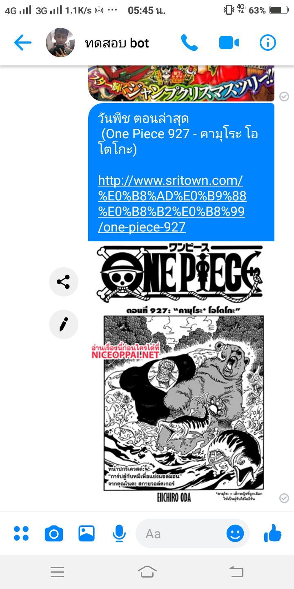

## DEMO

## หลักการ
- แปลง RSS จาก เว็บ sritown เป็น Json โดยใช้ Firebase Cloud Function ทำเป็น API (เก็บเฉพาะตอนล่าสุด ตอนเดียว)
- Cron เช็ค ทุกๆ 5 นาที  โดยอ้างอิงจาก ID ที่ได้จาก RSS ถ้าไม่มีอยู่ใน DB ให้บันทึกลง Firebase (จริงๆเช็ควันละครั้งก็ได้ แต่ผมอยากได้เม้นแรก -,,-)
- เมื่อมีข้อมูลใหม่เกิดขึ้นใน Firebase ให้ทำการส่งข้อความ + รูปภาพ ไปยัง บุคคล หรือ กลุ่ม Facebook  ที่กำหนดไว้

## อ่านแนวคิดจากบทความ https://medium.com/p/5d8875dfd2